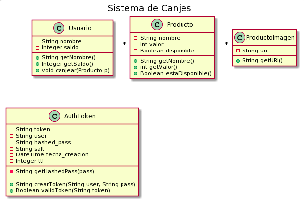

# Sistema de Canje de Puntos

## Introduccion

El presente documento es una descripción técnica de un sistema de canje de puntos.

Explica en detalle:

- Alcance del Sistema

- Diagrama de Clases

- Diagrama de Arquitectura

- Diagramas de Secuencia

## Alcance del Sistema

El alcance del sistema define qué funcionalidades del sistema están incluídas y cuáles **NO** están incluídas.

### Funcionalidades INCLUIDAS

- **Autenticación**: El sistema debe tener una forma de autenticar a los usuarios que usen la aplicación.

- **Canje**:
  - CANJEAR: Debe existir alguna forma de canjear los puntos disponibles
  - HISTORIAL DE CANJES: Debe poder verse el historial de los canjes del sistema

- **Productos**:
  - DATOS: Los productos deben tener al menos UN NOMBRE y una DESCRIPCION.
  - DISPONIBILIDAD: Los productos pueden ESTAR O NO disponibles.
  - IMAGENES: Los productos deben tener _como mínimo_ una imagen.
  - LISTAR: Debe existir una forma de listar los productos disponibles.
  - PUNTOS: Cada producto debe tener un valor en puntos.
  
- **Usuarios**:
  - DATOS: Los usuarios deben tener al menos UN NOMBRE y un CODIGO de identificación de socio del sistema
  - PUNTOS DISPONIBLES: Los usuarios deben tener un saldo de puntos disponibles

### Funcionalidades **NO** INCLUIDAS

- **Autorización**: No habrá roles. Por lo tanto no habrá autorización especial para los endpoints.

- **Gestión de Productos**: El sistema no tendrá la posibilidad de generar productos a través de la API.

- **Gestión de Usuarios**: El sistema NO tendrá la posibilidad de gestionar a los usuarios a través de la API.

- **Stock**: El stock de productos es ilimitado.

## Diagrama de Clases



<details>
  <summary>Codigo fuente para PlantUML</summary>
```
@startuml

title Sistema de Canjes

class Usuario {
  -String nombre
  -Integer saldo
  +String getNombre()
  +Integer getSaldo()
  +void canjear(Producto p)
}

class Producto {
  -String nombre
  -int valor
  -Boolean disponible
  +String getNombre()
  +int getValor()
  +Boolean estaDisponible()
}

class ProductoImagen {
  -String uri
  +String getURI()
}

class AuthToken {
  -String token
  -String user
  -String hashed_pass
  -String salt
  -DateTime fecha_creacion
  -Integer ttl
  -String getHashedPass(pass)
  
  +String crearToken(String user, String pass)
  +Boolean validToken(String token)
}

Usuario -right- "*" Producto
Producto -right- "*" ProductoImagen
Usuario -down- AuthToken

@enduml
```
</details>


## Diagrama de Base de Datos

## Diagrama de Secuencia
