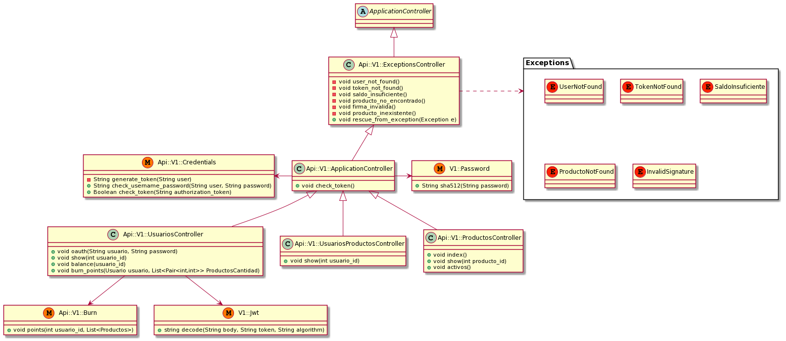
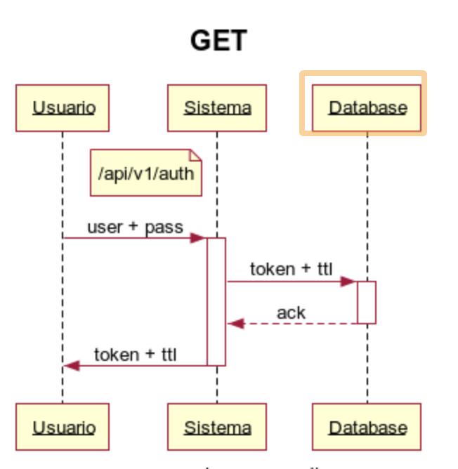

# Sistema de Canje de Puntos

## Introduccion

El presente documento es una descripción técnica de un sistema de canje de puntos.

Explica en detalle:

- Alcance del Sistema

- Diagrama de Clases

- Diagrama de Arquitectura

- Diagramas de Secuencia

## Alcance del Sistema

El alcance del sistema define qué funcionalidades del sistema están incluídas y cuáles **NO** están incluídas.

### Funcionalidades INCLUIDAS

- **Autenticación**: El sistema debe tener una forma de autenticar a los usuarios que usen la aplicación.

- **Canje**:
  - CANJEAR: Debe existir alguna forma de canjear los puntos disponibles
  - HISTORIAL DE CANJES: Debe poder verse el historial de los canjes del sistema

- **Productos**:
  - DATOS: Los productos deben tener al menos UN NOMBRE y una DESCRIPCION.
  - DISPONIBILIDAD: Los productos pueden ESTAR O NO disponibles.
  - IMAGENES: Los productos deben tener _como mínimo_ una imagen.
  - LISTAR: Debe existir una forma de listar los productos disponibles.
  - PUNTOS: Cada producto debe tener un valor en puntos.
  
- **Usuarios**:
  - DATOS: Los usuarios deben tener al menos UN NOMBRE y un CODIGO de identificación de socio del sistema
  - PUNTOS DISPONIBLES: Los usuarios deben tener un saldo de puntos disponibles

### Funcionalidades **NO** INCLUIDAS

- **Autorización**: No habrá roles. Por lo tanto no habrá autorización especial para los endpoints.

- **Gestión de Productos**: El sistema no tendrá la posibilidad de generar productos a través de la API.

- **Gestión de Usuarios**: El sistema NO tendrá la posibilidad de gestionar a los usuarios a través de la API.

- **Stock**: El stock de productos es ilimitado.

## Diagrama de Arquitectura


<details>
  <summary>Codigo fuente para PlantUML</summary>

```
@startuml

title Sistema de Canjes

actor Usuario
cloud Internet

package "API pública" {
    component Router
}

package "Middleware" {
    component Controllers
    component Models
}

package "Base de Datos" {
    database PostgreSQL
}

Usuario <-> Internet
Internet <-> Router
Router <-down-> Controllers
Controllers <-right-> Models
Models <-right-> PostgreSQL

@enduml
```

</details>


## Diagrama de Clases



<details>
  <summary>Codigo fuente para PlantUML</summary>

```
@startuml

title Sistema de Canjes

class Usuario {
  -String nombre
  -Integer saldo
  +String getNombre()
  +Integer getSaldo()
  +void canjear(Producto p)
}

class Producto {
  -String nombre
  -int valor
  -Boolean disponible
  +String getNombre()
  +int getValor()
  +Boolean estaDisponible()
}

class ProductoImagen {
  -String uri
  +String getURI()
}

class AuthToken {
  -String token
  -String user
  -String hashed_pass
  -String salt
  -DateTime fecha_creacion
  -Integer ttl
  -String getHashedPass(pass)
  
  +String crearToken(String user, String pass)
  +Boolean validToken(String token)
}

Usuario -right- "*" Producto
Producto -right- "*" ProductoImagen
Usuario -down- AuthToken

@enduml
```

</details>

## Diagrama de Base de Datos


<details>
  <summary>Codigo fuente para PlantUML</summary>

```
@startuml

title Classes - Diagrama de Base de Datos


class Usuario {
  + nombre : varchar
  + user : varchar
  + pass : varchar
  + saldo_puntos : int
  + created_at : datetime
}

class Producto {
  + nombre : varchar
  + puntos : int
  + activo : bool
  + created_at : datetime
}

class ProductoImagen {
  + nombre : varchar
  + principal : boolean
}

class UsuarioProducto {
  id_usuario : int
  id_producto : int
  puntos_usados : int
  fecha_canje : datetime
}

class Token {
  + token : varchar
  + ttl : int
  + created_at : datetime
}

Usuario -right- "*" UsuarioProducto
UsuarioProducto "*" -right- Producto
Usuario -down- Token
Producto -down- "*" ProductoImagen

@enduml
```

</details>

## Endpoints

En general toos los endpoints explicados debajo tienen un diarama de secuencia análogo.

Para no hacer el documento innecesariamente extenso pongo UN diagrama que muestra cómo sería un GET y un PATCH.

Además agrego el endpoint de POST para la autenticación (que es el único que crea un recurso).

### Autenticación | POST `/api/v1/user/auth`


<details>
  <summary>Codigo fuente para WebSequenceDiagrams</summary>

```
title Autenticación

participant Usuario
participant Sistema

note left of Sistema: /api/v1/auth

Usuario->+Sistema: user + pass
Sistema->+Database: token + ttl
Database-->-Sistema: ack
Sistema->-Usuario: token + ttl
```
</details>

### GET



<details>
  <summary>Codigo fuente para WebSequenceDiagrams</summary>

```
title GET

participant Usuario
participant Sistema

note left of Sistema: /api/v1/auth

Usuario->+Sistema: user + pass
Sistema->+Database: token + ttl
Database-->-Sistema: ack
Sistema->-Usuario: token + ttl
```
</details>

### PATCH


<details>
  <summary>Codigo fuente para WebSequenceDiagrams</summary>

```
title PATCH

participant Usuario
participant Sistema

note left of Sistema: <<endpoint correspondiente>> + JSON con los cambios al recurso

Usuario->+Sistema: (:id) del recurso
Sistema->+Database: query
Database-->-Sistema: datos del recurso
Sistema->-Usuario: JSON del recurso
```
</details>

### Canjear puntos | PATCH `/api/v1/user/:id/burn_points`

Este endpoint se utiliza para canjear puntos del usuario por productos.

### Obtener el los puntos restantes del usuario | GET `/api/v1/user/:id/balance`

Este endpoint se utiliza para obtener los datos del usuario.

### Listar Productos | GET `/api/v1/product/list`

Este endpoint se utiliza para listar los productos disponibles.

### Obtener Producto | GET `/api/v1/product/:id`

Este endpoint se utiliza para obtener los datos de un producto.

### Obtener imagenes extra | GET `/api/v1/product/:id/images`

Este endpoint se utiliza para obtener más imágenes del producto.

